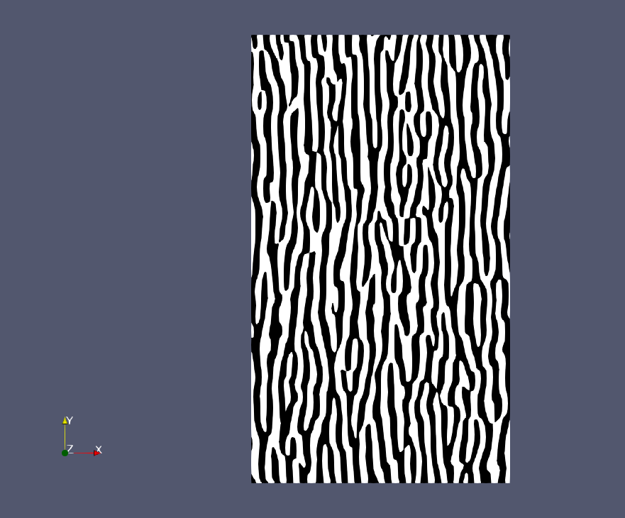
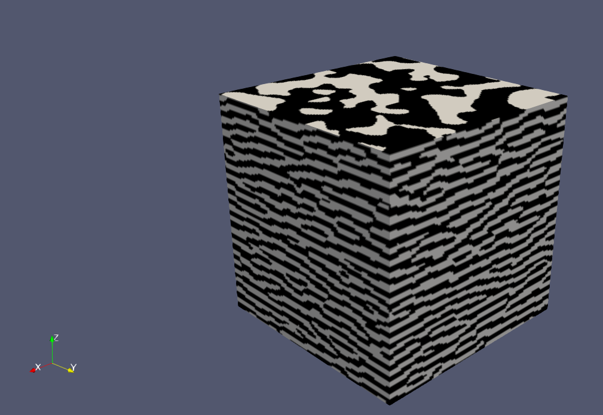

<meta charset="UTF-8">

## Description

Implementation of 2D and 3D procedural phasor noise:

> Procedural Phasor Noise <br>
> Thibault Tricard, Semyon Efremov, Cédric Zanni, Fabrice Neyret, Jonàs Martínez, Sylvain Lefebvre <br>
> ACM Transactions on Graphics (2019) <br>


## Installation

* Anaconda Python 3 distribution (https://www.anaconda.com/).

To deploy and activate the Anaconda environment:

```
conda env create --file environment_{OS}.yml
conda activate phasornoisepython
```

## Usage

Two examples are included. To produce them:

```
python phasor.py
```

The above command will output two VTK image data files (VTI). 

The VTI files can be visualized with Paraview (https://www.paraview.org/):

| phasor2dtest.vti  | phasor3dtest.vti |
|----------|:-------------:|
|  |   |


For more details on using the function that computes the phasor noise, see the documentation of the **phasor_noise** function within the **phasor.py** file.

## Authors

[Sylvain Lefebvre](https://www.antexel.com/sylefeb/research) and [Jonàs Martínez](https://sites.google.com/site/jonasmartinezbayona/).
